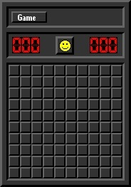

# Minesweeper (saper)

Podstawowym celem projektu jest zaimplementowanie wiernej kopii gry **Saper**.

### Założenia

- Wierna kopia
- Zmienne parametry planszy
- Implementacja odkrywania planszy po kliknięciu
- Implementacja generacji planszy
- Wyświetlanie planszy z wykorzystaniem pygamea
- Resetowanie planszy po kliknięciu w buźkę
- Implementacja odpbirania przytcisku myszy
- Zmiana motyw z zależności humoru użytkownika
- Wykrywanie wygrywania oraz przegranej
- Stworzenie animacji zwycięstwa oraz przegranej
- Stworzenie menu służącemu zmianie parametrów gry

### Podział zadań

#### Filip Hahs
  - Generowanie planszy
  - Implementacja klasy z ustawieniami gry
  - Funkcja sprawdzajaca wygrana i przegrana
  - Obsługa lewego i prawego kliknięcia
  - Wyświetlanie planszy
  - Implementacja głównego wątku gry
  - Obsługa zdarzeń
  - Bugfixy
  - Multiplayer (a nie, to jednak nie)
 
 #### Adam Jędrzejkowski
  - Odkrywanie planszy
  - Wyświetlanie napisów i pól wejściowych
  - Obsługa przycisków
  - Zliczanie czasu gry
  - Resetowanie planszy
  - Wyświetlanie przycisku i ramek
  - Stworzenie ciemnych grafik
  - Bugfixy
  
 #### Karolina Lubczańska
  - Obsługa środkowego kliknięcia myszy
  - Implementacja animacji przyciskania pól i przycisków
  - Zliczanie punktów (ilości kliknięć)
  - Wyświetlanie wyświetlaczy i buźki
  - Ładowanie grafik do pygame
  - Stworzenie jasnych grafik
  - Bugfixy
  
  ### Screenshoty z gry
  
  &nbsp;&nbsp;&nbsp;&nbsp;&nbsp;&nbsp;&nbsp;&nbsp;&nbsp;&nbsp;&nbsp;&nbsp;&nbsp;&nbsp;&nbsp;&nbsp;&nbsp;&nbsp;&nbsp;&nbsp;&nbsp; &nbsp;&nbsp;&nbsp;&nbsp;&nbsp;&nbsp;&nbsp;&nbsp;&nbsp;&nbsp;&nbsp;&nbsp;&nbsp;&nbsp;&nbsp;&nbsp;&nbsp;&nbsp;&nbsp;&nbsp;&nbsp;&nbsp;&nbsp;&nbsp;&nbsp;&nbsp;&nbsp;&nbsp;&nbsp;&nbsp;&nbsp;&nbsp;&nbsp;&nbsp;&nbsp;&nbsp;&nbsp;&nbsp;&nbsp;&nbsp;&nbsp;&nbsp;&nbsp;&nbsp;&nbsp;&nbsp;&nbsp;&nbsp;&nbsp;&nbsp;&nbsp;&nbsp;&nbsp;&nbsp;&nbsp;&nbsp;&nbsp;&nbsp;&nbsp;&nbsp;&nbsp;
